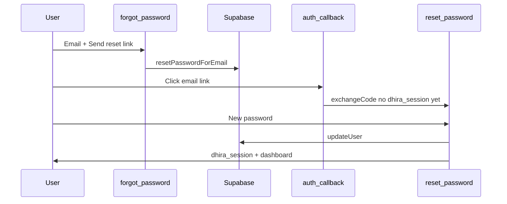

# Email password reset (Supabase) — Dhira checklist

Passwords for **email + password** accounts live in **Supabase Auth** only. After reset, sign-in always uses the new password—no extra sync in Dhira’s profile store.

**Related:** [Google sign-in](./SUPABASE_GOOGLE_AUTH.md) · [Phone OTP](./SUPABASE_PHONE_OTP.md) (no password to reset)

## 1. Environment (Vercel + `.env.local`)

Same keys as other Supabase auth docs:

| Variable | Where |
|----------|--------|
| `NEXT_PUBLIC_SUPABASE_URL` | Supabase → Settings → API |
| `NEXT_PUBLIC_SUPABASE_ANON_KEY` | Publishable / anon key |
| `SUPABASE_SERVICE_ROLE_KEY` | Secret key (server `/api/auth/session`) |

Production: **https://dhira-2-0-xi.vercel.app**

## 2. Supabase → Authentication

1. **Providers → Email** — enabled (password reset uses email).
2. **URL configuration** — redirect URLs must include:
   - `https://dhira-2-0-xi.vercel.app/auth/callback`
   - `http://localhost:4028/auth/callback`  
   (Same as Google; query `?next=/reset-password` does not need a separate whitelist entry.)
3. **Email templates → Reset password** — optional branding; link must reach your app via `redirectTo`.

### One command (developers / agent)

If you have a Supabase access token:

```bash
SUPABASE_ACCESS_TOKEN=sbp_... npm run ensure:supabase-auth-urls
```

Verify:

```bash
npm run verify:password-reset
```

## 3. App flow (code)

| Step | Route / file |
|------|----------------|
| Sign-in link | [`/sign-in`](/sign-in) → **Forgot Password** → [`/forgot-password`](/forgot-password) |
| Send link | `requestPasswordReset` in [`src/lib/authClient.ts`](../src/lib/authClient.ts) |
| Email link | Supabase → [`GET /auth/callback?code=…&next=/reset-password`](../src/app/auth/callback/route.ts) |
| New password | [`/reset-password`](../src/app/reset-password/page.tsx) → `updateUser` + `/api/auth/session` |
| Done | Redirect **`/home-dashboard`** |



## 4. Test

```bash
npm run dev
```

1. Open **http://localhost:4028/sign-in** (Email tab) → **Forgot Password**.
2. Enter an account that was created with **email + password** (not phone-only).
3. Open the email → set new password → land on **home dashboard**.
4. Sign out → sign in with the **new** password only.

## 5. Troubleshooting

| Symptom | Likely cause |
|---------|----------------|
| No email | Supabase mailer / SMTP; spam folder; rate limits |
| Redirect / “invalid link” | Missing `/auth/callback` in Supabase redirect URLs — run `ensure:supabase-auth-urls` |
| Reset page says link expired | Open link on same browser; request a new link (links expire) |
| Phone user | No password — use **Phone OTP** on sign-in instead |
| Dev without Supabase keys | Forgot flow shows “Connect Supabase” — use `.env.local` with real keys |

## 6. Who can reset?

- **Email + password** sign-up or sign-in: yes.
- **Google OAuth** only: use Google account recovery, not this page.
- **Phone OTP** only: no password — not applicable.
