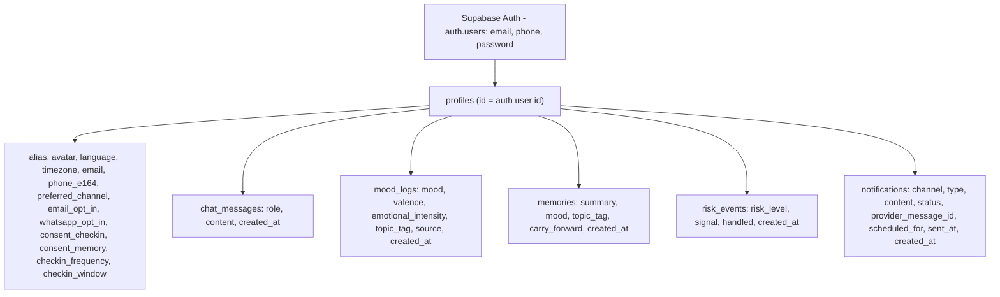
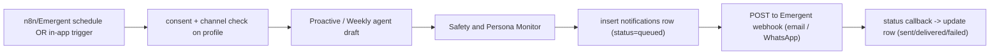

# Dhira — Supabase data model

How Dhira stores data once a real Supabase project is connected. Identity comes
from Supabase Auth; every other table hangs off the user's profile by `profile_id`.

## Mindmap

## Notification delivery (Emergent), safety-gated

## Tables

- profiles — one row per user (id = `auth.users.id`). Alias/avatar/language,
  contact (email, phone_e164), channel preference + opt-ins, timezone, and the
  check-in contract (consent + frequency + window).
- chat_messages — every user/Dhira turn.
- mood_logs — the mood timeline (auto-tagged from chat + manual check-ins).
- memories — short, safe "Dhira remembers" notes (no raw PII).
- risk_events — the safety log (crisis/medium events + whether the hand-off fired).
- notifications — each outbound email/WhatsApp message and its delivery status.

## Security

Row-Level Security is ON for every table and scoped to `auth.uid()`, so each
person can only ever touch their own rows. Dhira's server uses the service-role
key for agent writes and admin aggregates; that key is server-only.

## Emergent integration seam

The app never talks to Twilio/Gmail directly. It writes a `notifications` row
(status `queued`) and POSTs the payload to an Emergent workflow webhook
(`EMERGENT_NOTIFY_WEBHOOK_URL`, protected by `EMERGENT_WEBHOOK_SECRET`).
Emergent delivers via its vault-managed providers and calls
`POST /api/notifications/callback` to update the row's status. Demo over email;
WhatsApp turns on via `WHATSAPP_ENABLED` once the business sender is approved.
